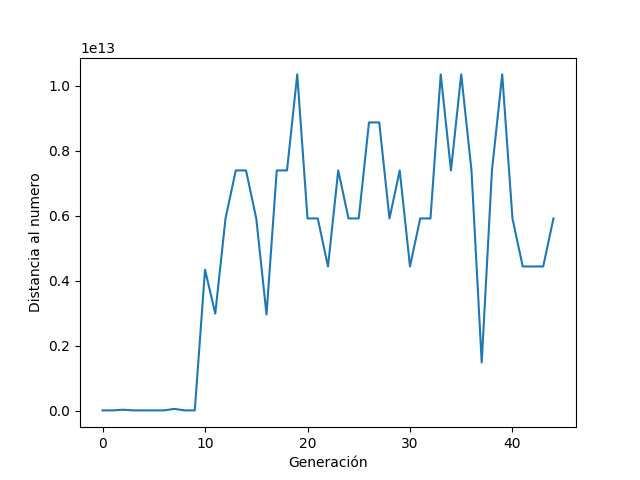

# Tarea3rn

## 2.1.1 Encontrar Número (con repeticion)

    Se trata de buscar el número 65346 para los terminales {25,7,8,100,4,2} y las funciones {+,−,∗, max(·)}.
    Para esto se usa una funcion de fitness que es el valor absoluto de la diferencia entre el número y la evaluación de la expresión contenida en el árbol, la cual se quiere Minimizar en todas las pruebas siguientes.

    Para un algoritmo gen{etico de las siguientes parametros
        Población 20
        Tasa de mutacion 0.1
        Iteraciones 50
        
    Quedando como la siguiente figura el fitness:
|

    Mejor individuo:
 (max({100, max({(max({(((25 + (((4 + 8) - 25) + (7 - 8))) + ((max({25, (7 - (100 * 7))}) * (2 * 7)) - 7)) * 100), (25 - 25)}) - (((max({8, ((7 - 7) * max({7, 25}))}) + max({(((max({25, ((2 - 7) * max({7, 25}))}) + max({max({(2 + (4 + 2)), 8}), (max({max({((((100 - 7) * (8 * (max({8, 100}) - (8 - 2)))) - (((100 * 7) + ((4 - 25) + (7 - 8))) + ((max({7, 2}) * (100 * 7)) - (2 * 4)))) + ((max({4, ((7 - 25) + (max({8, (25 + ((4 - 25) + (7 - 8)))}) - (8 - 2)))}) + (100 + (max({8, (25 + ((4 - 25) + (7 - 8)))}) - (8 - 2)))) * 8)), 7}), ((7 - 7) * max({7, 25}))}) + max({max({(2 + (4 + 2)), 8}), (7 - max({max({(2 + (4 + 2)), 8}), 4}))}))})) * 25) * 100), (7 - max({max({(2 + ((max({8, ((7 - 4) * max({7, 25}))}) + max({(((max({25, ((7 - 7) * max({7, 25}))}) + max({max({(2 + (4 + 2)), 8}), (max({25, ((7 - 7) * max({7, 25}))}) + max({max({(2 + (4 + 2)), 8}), (7 - max({max({(2 + (4 + 2)), 8}), 4}))}))})) * 25) * 100), (7 - max({25, 4}))})) + 2)), 8}), 4}))})) * 25) * 100)), 4})}) + ((max({((((100 - 7) * (8 * (max({8, 100}) - (8 - 2)))) - (((100 * 7) + ((4 - 25) + (7 - 8))) + ((max({7, 2}) * (100 * 7)) - (2 * 4)))) + ((max({4, ((7 - 25) + (max({8, (25 + ((4 - 25) + (7 - 8)))}) - (8 - 2)))}) + (100 + (max({8, (25 + ((4 - max({100, max({(max({(((25 + (((4 + 8) - 25) + (7 - 8))) + ((max({max({8, 100}), (7 - 25)}) * (2 * 7)) - 4)) * 8), (25 - 25)}) - (((((100 - 7) * (8 * (max({8, 100}) - (8 - 2)))) + 4) * 25) * 100)), 4})})) + (7 - 100)))}) - (8 - 2)))) * 8)), 7}) + 8) + 25))

    resultado:	 65347
    puntaje:	 1

Cabe destacar que 

## 2.1.2 Encontrar Número (con mas corto)
 se agrega un puntaje para no repetir de  el largo del serializer por un coeficiente para tratar de que hayan árbles más pequeños:
    Quedando como la siguiente figura el fitness:
|

mejor individuo:
 max({(8 + 25), max({max({max({((max({max({(7 - 4), 7}), max({(((8 + 25) + 25) * (25 - 8)), 8})}) + 25) - max({7, 2})), ((max({(((4 * 25) * (25 * 25)) + 4), 100}) + 2) - (7 + 25))}), ((4 * 25) * (25 * 25))}), (8 + 4)})})
resultado:	 62500
puntaje:	 2903

en donde se pueden ver mas variaciones debido a que al tener menos variables una mutacion puede empeorar mucho los resultados.

## 2.1.3 Encontrar Número (sin repeticion)

finalmente se penaliza a través de la diferencia entre el largo del arreglo de terminales versus el largo del arreglo de terminales únicos que aparecen, multiplicando por un coeficiente que en este caso es el mismo.
Si bien esto puede mejorar en algunos casos, también puede ser que encuentre arboles triviales para no repetir caracteres como este, esto también puede tener que ver con que tiene pocas opciones en donde elegir :
|

mejor individuo:
 4
resultado:	 4
puntaje:	 65342

## 2.2 Implementar variables.

En el caso de la implementación de variables se agregó un diccionario tal como lo sugiere el enunciado, y en la parte de evaluacion de los términales se debe probar si es que es un string, en ese caso se busca en el diccionario el valor asociado a ese string (variable) para evaluarlo posterior y no anterior como se puede ver en el codigo.

Se pasó de :

        def eval(self, diccionario=None):
            return self.value

A esto:

        def eval(self, diccionario=None):
            if isinstance(self.value, str):
                return diccionario[self.value]
            else:
                return self.value

## 2.2 Symbolic Regression

En este caso, usando la implementación de variables, se cambia la funciónh de fitness y se agrega un rango para probar como sería un buen ajuste, en el caso de la comparación se hace a través de error cuadrático.

aquí se puede ver un caso exitoso de en el cual el mejor individuo para ajustar x*x + x-6 es-> x*x con un puntaje de  683936 ( error cuadrático) para rango de -100 a 100 :

|

Y el fitness:

|

En otros casos solo logra un ajuste lineal o una constante:

|

